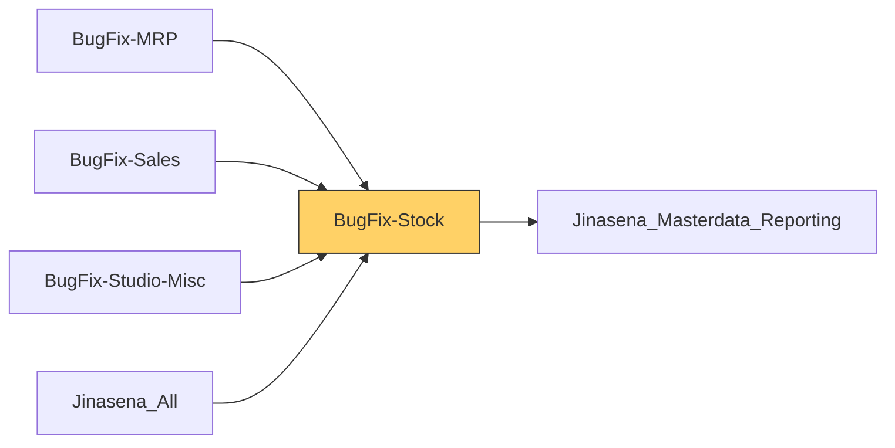

# Functional Documentation — BugFix-Stock

> Generated by `scripts/generate_functional_docs.py` from branch `Visual_Migration_02` (commit 64952ee 2026-10-08) and the installed module on the clean environment. For every attribute: **Function** = what it does, **Depends on** = the attributes it relies on (owning module in brackets when it is not this repo), **Used by** = the attributes in any Jinasena repo that rely on it.

| Item | Value |
|---|---|
| Technical name | `BugFix-Stock` |
| Title | Jinasena : Module : Inventory |
| Version | `17.0.0.0.123` |
| Category | Inventory |
| License | LGPL-3 |
| Installed on environment | installed 17.0.0.0.123 |
| History | [CHANGELOG.md](CHANGELOG.md) |

## Purpose

<!-- SUMMARY:repo -->
BugFix-Stock is the Jinasena Inventory module. It ships as code the inventory customisations first built in Odoo Studio, and it is also home to the import consignment process and the internal material request process. It is used by warehouse and inventory staff, by the imports team who track shipments from overseas suppliers through customs to goods receipt, and by departments that request material from stores. Sales, Accounting, Purchase and repair modules build on its transfer, location and consignment fields.

- Import consignments: consignment headers and lines copied from import purchase orders, vendor despatch, port receipt, customs clearance and duty entries, header and line charge allocation, consolidation of several consignments, and supplier invoice numbers carried onto receipts.
- Charge set-up: Misc Charge Codes, Tariff Master (customs tariff codes) and the Apply Formula helper for charge structures.
- Material requests: request, confirm, approve or reject, create the stores transfer and raise purchase requests; also two Studio-generated material request apps (MT and Test).
- Transfers: repair, payment and location-check fields, transfer approval and rejection, movement journal offset accounts, source document from the sales order, project transfer completion notices, and approval rules on cancel, label printing and put in pack.
- Locations, lots, moves and valuation layers: repair and finished-good location flags, permitted users per location, serial number settings, report type tagging and extra list columns.
- Multi-company record rules and access rights for stock models.
<!-- /SUMMARY -->

## Module dependencies

| Kind | Modules |
|---|---|
| Odoo standard / enterprise | `base_setup`, `stock`, `stock_account`, `stock_landed_costs`, `helpdesk_stock` |
| Jinasena repos | `Jinasena_Masterdata_Reporting` |
| Third-party apps |  |
| Used by (Jinasena repos that depend on this one) | `BugFix-MRP`, `BugFix-Sales`, `BugFix-Studio-Misc`, `Jinasena_All` |

## Contents at a glance

| Attribute type | Count |
|---|---|
| Models created | 22 |
| Models extended | 27 |
| Fields | 1004 |
| Python methods | 8 |
| Views | 92 |
| Window actions | 132 |
| Server actions | 105 |
| Automations | 35 |
| Approval rules | 3 |
| Menus | 35 |
| Access rights | 71 |
| Record rules | 33 |
| Install hooks | 2 |
| Migration scripts | 6 |

## Models

Each model has its own page (the full reference is too large for one GitHub page).

| Model | Description | Created / extends | Fields | Views | Actions + automations | Approvals |
|---|---|---|---|---|---|---|
| [`account.move`](functional_docs/account.move.md) | Journal Entry | extends (account) | 0 | 0 | 0 | 0 |
| [`product.product`](functional_docs/product.product.md) | Product Variant | extends (product) | 1 | 0 | 0 | 0 |
| [`stock.backorder.confirmation`](functional_docs/stock.backorder.confirmation.md) | Backorder Confirmation | extends (stock) | 0 | 0 | 0 | 0 |
| [`stock.backorder.confirmation.line`](functional_docs/stock.backorder.confirmation.line.md) | Backorder Confirmation Line | extends (stock) | 0 | 0 | 0 | 0 |
| [`stock.landed.cost`](functional_docs/stock.landed.cost.md) | Stock Landed Cost | extends (stock_landed_costs) | 0 | 1 | 0 | 0 |
| [`stock.landed.cost.lines`](functional_docs/stock.landed.cost.lines.md) | Stock Landed Cost Line | extends (stock_landed_costs) | 0 | 0 | 0 | 0 |
| [`stock.location`](functional_docs/stock.location.md) | Inventory Locations | extends (stock) | 10 | 2 | 0 | 0 |
| [`stock.lot`](functional_docs/stock.lot.md) | Lot/Serial | extends (stock) | 20 | 1 | 0 | 0 |
| [`stock.move`](functional_docs/stock.move.md) | Stock Move | extends (stock) | 8 | 2 | 9 | 0 |
| [`stock.move.line`](functional_docs/stock.move.line.md) | Product Moves (Stock Move Line) | extends (stock) | 4 | 1 | 3 | 0 |
| [`stock.picking`](functional_docs/stock.picking.md) | Transfer | extends (stock) | 51 | 3 | 30 | 3 |
| [`stock.picking.type`](functional_docs/stock.picking.type.md) | Picking Type | extends (stock) | 3 | 3 | 0 | 0 |
| [`stock.putaway.rule`](functional_docs/stock.putaway.rule.md) | Putaway Rule | extends (stock) | 0 | 0 | 0 | 0 |
| [`stock.quant`](functional_docs/stock.quant.md) | Quants | extends (stock) | 0 | 0 | 0 | 0 |
| [`stock.quant.package`](functional_docs/stock.quant.package.md) | Packages | extends (stock) | 0 | 0 | 0 | 0 |
| [`stock.quantity.history`](functional_docs/stock.quantity.history.md) | Stock Quantity History | extends (stock) | 0 | 0 | 0 | 0 |
| [`stock.return.picking`](functional_docs/stock.return.picking.md) | Return Picking | extends (stock) | 5 | 2 | 4 | 0 |
| [`stock.return.picking.line`](functional_docs/stock.return.picking.line.md) | Return Picking Line | extends (stock) | 0 | 0 | 0 | 0 |
| [`stock.route`](functional_docs/stock.route.md) | Inventory Routes | extends (stock) | 0 | 1 | 0 | 0 |
| [`stock.rule`](functional_docs/stock.rule.md) | Stock Rule | extends (stock) | 0 | 1 | 0 | 0 |
| [`stock.scheduler.compute`](functional_docs/stock.scheduler.compute.md) | Run Scheduler Manually | extends (stock) | 0 | 0 | 0 | 0 |
| [`stock.scrap`](functional_docs/stock.scrap.md) | Scrap | extends (stock) | 0 | 0 | 0 | 0 |
| [`stock.traceability.report`](functional_docs/stock.traceability.report.md) | Traceability Report | extends (stock) | 0 | 0 | 0 | 0 |
| [`stock.valuation.layer`](functional_docs/stock.valuation.layer.md) | Stock Valuation Layer | extends (stock_account) | 4 | 1 | 5 | 0 |
| [`stock.warehouse`](functional_docs/stock.warehouse.md) | Warehouse | extends (stock) | 0 | 1 | 0 | 0 |
| [`stock.warehouse.orderpoint`](functional_docs/stock.warehouse.orderpoint.md) | Minimum Inventory Rule | extends (stock) | 0 | 0 | 0 | 0 |
| [`x_con_consolidated_hea`](functional_docs/x_con_consolidated_hea.md) | Con. Consolidated Header | created | 39 | 5 | 12 | 0 |
| [`x_con_consolidated_lin`](functional_docs/x_con_consolidated_lin.md) | Con. Consolidated Line | created | 45 | 5 | 6 | 0 |
| [`x_consignment_charge_h`](functional_docs/x_consignment_charge_h.md) | Consignment Charge Header | created | 22 | 0 | 3 | 0 |
| [`x_consignment_charge_l`](functional_docs/x_consignment_charge_l.md) | Consignment Charge Line | created | 47 | 5 | 3 | 0 |
| [`x_consignment_header`](functional_docs/x_consignment_header.md) | Consignment Header | created | 83 | 7 | 28 | 0 |
| [`x_consignment_line`](functional_docs/x_consignment_line.md) | Consignment Line | created | 99 | 5 | 9 | 0 |
| [`x_journal_types`](functional_docs/x_journal_types.md) | Journal Types | extends (BugFix-Maintenance) | 12 | 0 | 0 | 0 |
| [`x_material_request`](functional_docs/x_material_request.md) | Material Request | created | 53 | 4 | 16 | 0 |
| [`x_material_request_mt`](functional_docs/x_material_request_mt.md) | Material Request MT | created | 62 | 12 | 2 | 0 |
| [`x_material_request_mt_stage`](functional_docs/x_material_request_mt_stage.md) | Material Request MT Stages | created | 8 | 3 | 0 | 0 |
| [`x_material_request_mt_tag`](functional_docs/x_material_request_mt_tag.md) | Material Request MT Tags | created | 8 | 3 | 0 | 0 |
| [`x_material_request_tes`](functional_docs/x_material_request_tes.md) | Material Request Test | created | 50 | 9 | 0 | 0 |
| [`x_material_request_tes_stage`](functional_docs/x_material_request_tes_stage.md) | Material Request Test Stages | created | 8 | 3 | 0 | 0 |
| [`x_material_request_tes_tag`](functional_docs/x_material_request_tes_tag.md) | Material Request Test Tags | created | 8 | 3 | 0 | 0 |
| [`x_misc_charge_codes`](functional_docs/x_misc_charge_codes.md) | Misc Charge Codes | created | 17 | 0 | 0 | 0 |
| [`x_mr_config`](functional_docs/x_mr_config.md) | MR config | created | 62 | 0 | 0 | 0 |
| [`x_tariffmaster`](functional_docs/x_tariffmaster.md) | TariffMaster | created | 35 | 5 | 3 | 0 |
| [`x_temp_con_conso_line`](functional_docs/x_temp_con_conso_line.md) | Temp Con. Conso. Line | created | 45 | 0 | 0 | 0 |
| [`x_temp_con_consolidate`](functional_docs/x_temp_con_consolidate.md) | Temp Con. Consolidated Header | created | 36 | 1 | 3 | 0 |
| [`x_temp_consignment_hea`](functional_docs/x_temp_consignment_hea.md) | Temp Consignment Header | created | 36 | 2 | 3 | 0 |
| [`x_temp_consignment_lin`](functional_docs/x_temp_consignment_lin.md) | Temp Consignment Line | created | 52 | 0 | 0 | 0 |
| [`x_temp_structure_detai`](functional_docs/x_temp_structure_detai.md) | Temp Structure Details | created | 37 | 0 | 0 | 0 |
| [`x_temp_structure_maste`](functional_docs/x_temp_structure_maste.md) | Temp Structure Master | created | 34 | 1 | 1 | 0 |

## Menus

**Menus (35):**

| Name | Record name | State | Function | Depends on | Used by |
|---|---|---|---|---|---|
| Consignment Line | `menu_f6_consignment_line` | hidden | Menu **Consignment Line** — opens _Purchase Invoice Line_. | `window action BugFix-Stock.action_1257_purchase_invoice_line` |  |
| Inventory/Inventory Setup | `menu_1148_inventory_setup` |  | Menu **Inventory/Inventory Setup** — folder that groups the menus under it. |  |  |
| Inventory/Inventory Setup/Location | `menu_1150_location` |  | Menu **Inventory/Inventory Setup/Location** — opens _Location_. | `window action BugFix-Stock.action_2470_location` |  |
| Inventory/Inventory Setup/Location | `menu_f6_location` | hidden | Menu **Inventory/Inventory Setup/Location** — opens _Location_. | `window action BugFix-Stock.act_window_2470_location` |  |
| Inventory/Inventory Setup/Warehouse | `menu_1149_warehouse` |  | Menu **Inventory/Inventory Setup/Warehouse** — opens _Warehouse_. | `window action BugFix-Stock.action_2469_warehouse` |  |
| Inventory/Reporting/Consignment Header Analysis | `menu_x_consignment_header_analysis` |  | Menu **Inventory/Reporting/Consignment Header Analysis** — opens _Consignment Header Analysis_. | `window action BugFix-Stock.action_x_consignment_header_analysis` |  |
| Inventory/wAREHOUSE | `menu_1147_inventory_warehouse` |  | Menu **Inventory/wAREHOUSE** — folder that groups the menus under it. |  |  |
| Inventory/wAREHOUSE/WareHouse | `menu_1146_warehouse` |  | Menu **Inventory/wAREHOUSE/WareHouse** — opens _WareHouse_. | `window action BugFix-Stock.action_2468_warehouse` |  |
| Manufacturing/Inventory Holding Days | `menu_1072_inventory_holding_days` |  | Menu **Manufacturing/Inventory Holding Days** — opens _Inventory Holding Days_. | `window action BugFix-Stock.action_2225_inventory_holding_days` |  |
| Manufacturing/Inventory Holding Days | `menu_f6_inventory_holding_days` |  | Menu **Manufacturing/Inventory Holding Days** — opens _Inventory Holding Days_. | `window action BugFix-Stock.act_window_2225_inventory_holding_days` |  |
| Material Management | `menu_827_material_management` |  | Menu **Material Management** — folder that groups the menus under it. |  |  |
| Material Management Module | `menu_1745_material_management_module` |  | Menu **Material Management Module** — folder that groups the menus under it. |  |  |
| Material Management Module/Configuration | `menu_1747_configuration` |  | Menu **Material Management Module/Configuration** — folder that groups the menus under it. |  |  |
| Material Management Module/Configuration/Material Request MT Stages | `menu_1748_material_request_mt_stages` |  | Menu **Material Management Module/Configuration/Material Request MT Stages** — opens _Material Request MT Stages_. | `window action BugFix-Stock.act_window_3385_material_request_mt_stages` |  |
| Material Management Module/Configuration/Material Request MT Stages | `menu_f6_material_request_mt_stages` |  | Menu **Material Management Module/Configuration/Material Request MT Stages** — opens _Material Request MT Stages_. | `window action BugFix-Stock.act_window_3385_material_request_mt_stages` |  |
| Material Management Module/Configuration/Material Request MT Tags | `menu_1749_material_request_mt_tags` |  | Menu **Material Management Module/Configuration/Material Request MT Tags** — opens _Material Request MT Tags_. | `window action BugFix-Stock.act_window_3386_material_request_mt_tags` |  |
| Material Management Module/Configuration/Material Request MT Tags | `menu_f6_material_request_mt_tags` |  | Menu **Material Management Module/Configuration/Material Request MT Tags** — opens _Material Request MT Tags_. | `window action BugFix-Stock.act_window_3386_material_request_mt_tags` |  |
| Material Management Module/Configuration/Material Request Test Stages | `menu_f6_material_request_test_stages` |  | Menu **Material Management Module/Configuration/Material Request Test Stages** — opens _Material Request Test Stages_. | `window action BugFix-Stock.act_window_3375_material_request_test_stages` |  |
| Material Management Module/Configuration/Material Request Test Tags | `menu_f6_material_request_test_tags` |  | Menu **Material Management Module/Configuration/Material Request Test Tags** — opens _Material Request Test Tags_. | `window action BugFix-Stock.act_window_3376_material_request_test_tags` |  |
| Material Management Module/Material Request MT | `menu_1746_material_request_mt` |  | Menu **Material Management Module/Material Request MT** — opens _Material Request MT_. | `window action BugFix-Stock.act_window_3384_material_request_mt` |  |
| Material Management Module/Material Request MT | `menu_f6_material_request_mt` |  | Menu **Material Management Module/Material Request MT** — opens _Material Request MT_. | `window action BugFix-Stock.act_window_3384_material_request_mt` |  |
| Material Management Module/Material Request Test | `menu_f6_material_request_test` |  | Menu **Material Management Module/Material Request Test** — opens _Material Request Test_. | `window action BugFix-Stock.act_window_3374_material_request_test` |  |
| Material Management/Configuration | `menu_829_configuration` |  | Menu **Material Management/Configuration** — folder that groups the menus under it. |  |  |
| Material Management/Material Request | `menu_828_material_request` |  | Menu **Material Management/Material Request** — opens _Material Request_. | `window action BugFix-Stock.act_window_1562_material_request` |  |
| Purchase/Configuration/Setups | `menu_f6_setups` | hidden | Menu **Purchase/Configuration/Setups** — opens _TariffMaster_. | `window action BugFix-Stock.act_window_1159_tariffmaster` |  |
| Purchase/Imports - 01 | `menu_f6_imports_01` | hidden | Menu **Purchase/Imports - 01** — opens _Imports - 01_. | `window action BugFix-Stock.action_1323_imports_01` |  |
| Purchase/Reporting/Custom Duty | `menu_1075_custom_duty` |  | Menu **Purchase/Reporting/Custom Duty** — opens _Custom Duty_. | `window action BugFix-Stock.action_2231_custom_duty` |  |
| Purchase/Reporting/Custom Duty | `menu_f6_custom_duty` | hidden | Menu **Purchase/Reporting/Custom Duty** — opens _Custom Duty_. | `window action BugFix-Stock.action_2231_custom_duty` |  |
| Purchase/Tariff Master | `menu_f6_tariff_master` | hidden | Menu **Purchase/Tariff Master** — opens _Tariff Master_. | `window action BugFix-Stock.act_window_2041_tariff_master` |  |
| Settings/Temp Consignment Header | `menu_f6_temp_consignment_header_1` |  | Menu **Settings/Temp Consignment Header** — opens _Temp Consignment Header_. | `window action BugFix-Stock.action_2861_temp_consignment_header` |  |
| Tariffs Master | `menu_f6_tariffs_master` | hidden | Menu **Tariffs Master** — opens _TariffMaster_. | `window action BugFix-Stock.act_window_1159_tariffmaster` |  |
| Temp Consignment Header | `menu_779_temp_consignment_header` |  | Menu **Temp Consignment Header** — opens _Temp Consignment Header_. | `window action BugFix-Stock.action_1259_temp_consignment_header` |  |
| Temp Consignment Header | `menu_f6_temp_consignment_header` |  | Menu **Temp Consignment Header** — opens _Temp Consignment Header_. | `window action BugFix-Stock.action_2861_temp_consignment_header` |  |
| Temp Consignment Line | `menu_778_temp_consignment_line` |  | Menu **Temp Consignment Line** — opens _Temp Consignment Line_. | `window action BugFix-Stock.action_1262_temp_consignment_line` |  |
| Temp Consignment Line | `menu_f6_temp_consignment_line` |  | Menu **Temp Consignment Line** — opens _Temp Consignment Line_. | `window action BugFix-Stock.action_1356_temp_consignment_line` |  |

## Data records loaded (75)

Records this module creates on install (lookup values, sequences, defaults, companies, users …).

| Type | Record name | Function | Depends on | Used by |
|---|---|---|---|---|
| `ir.default` | `default_final_bugfix_stock_field_x_temp_structure_detai_x_active_true` | Sets the default of **Active (Temp Structure Details)** to `true`. | `x_temp_structure_detai.x_active` |  |
| `ir.default` | `default_final_bugfix_stock_field_x_temp_structure_maste_x_active_true` | Sets the default of **Active (Temp Structure Master)** to `true`. | `x_temp_structure_maste.x_active` |  |
| `ir.default` | `default_final_bugfix_stock_field_x_temp_con_consolidate_x_active_true` | Sets the default of **Active (Temp Con. Consolidated Header)** to `true`. | `x_temp_con_consolidate.x_active` |  |
| `ir.default` | `default_final_bugfix_stock_field_x_temp_con_conso_line_x_active_true` | Sets the default of **Active (Temp Con. Conso. Line)** to `true`. | `x_temp_con_conso_line.x_active` |  |
| `ir.default` | `default_final_bugfix_stock_field_x_material_request_tes_x_active_true` | Sets the default of **Active (Material Request Test)** to `true`. | `x_material_request_tes.x_active` |  |
| `ir.default` | `default_final_bugfix_stock_field_x_material_request_mt_x_active_true` | Sets the default of **Active (Material Request MT)** to `true`. | `x_material_request_mt.x_active` |  |
| `ir.default` | `default_BugFix_Stock_field_x_material_request_tes__x_studi_1` | Sets the default of **Stage (Material Request Test)** to `1`. | `x_material_request_tes.x_studio_stage_id` |  |
| `ir.default` | `default_89_stock_lot_x_studio_sequence_size` | Sets the default of **Sequence Size (Lot/Serial)** to `"0"`. | `stock.lot.x_studio_sequence_size` |  |
| `ir.default` | `default_90_stock_lot_x_studio_starting_serial_no` | Sets the default of **Starting Serial No (Lot/Serial)** to `"0"`. | `stock.lot.x_studio_starting_serial_no` |  |
| `ir.default` | `default_91_x_tariffmaster_x_active` | Sets the default of **Active (TariffMaster)** to `true`. | `x_tariffmaster.x_active` |  |
| `ir.default` | `default_92_x_tariffmaster_x_studio_sequence` | Sets the default of **Sequence (TariffMaster)** to `10`. | `x_tariffmaster.x_studio_sequence` |  |
| `ir.default` | `default_124_x_temp_structure_detai_x_studio_sequence` | Sets the default of **Sequence (Temp Structure Details)** to `10`. | `x_temp_structure_detai.x_studio_sequence` |  |
| `ir.default` | `default_126_x_temp_structure_maste_x_studio_sequence` | Sets the default of **Sequence (Temp Structure Master)** to `10`. | `x_temp_structure_maste.x_studio_sequence` |  |
| `ir.default` | `default_138_x_consignment_header_x_active` | Sets the default of **Active (Consignment Header)** to `true`. | `x_consignment_header.x_active` |  |
| `ir.default` | `default_139_x_consignment_header_x_studio_sequence` | Sets the default of **Sequence (Consignment Header)** to `10`. | `x_consignment_header.x_studio_sequence` |  |
| `ir.default` | `default_140_x_consignment_line_x_active` | Sets the default of **Active (Consignment Line)** to `true`. | `x_consignment_line.x_active` |  |
| `ir.default` | `default_141_x_consignment_line_x_studio_sequence` | Sets the default of **Sequence (Consignment Line)** to `10`. | `x_consignment_line.x_studio_sequence` |  |
| `ir.default` | `default_142_x_consignment_header_x_name` | Sets the default of **Invoice Reference (Consignment Header)** to `"New"`. | `x_consignment_header.x_name` |  |
| `ir.default` | `default_146_x_consignment_line_x_currency_id` | Sets the default of **Currency (Consignment Line)** to `145`. | `x_consignment_line.x_currency_id` |  |
| `ir.default` | `default_148_x_temp_consignment_hea_x_active` | Sets the default of **Active (Temp Consignment Header)** to `true`. | `x_temp_consignment_hea.x_active` |  |
| `ir.default` | `default_149_x_temp_consignment_hea_x_studio_sequence` | Sets the default of **Sequence (Temp Consignment Header)** to `10`. | `x_temp_consignment_hea.x_studio_sequence` |  |
| `ir.default` | `default_150_x_temp_consignment_lin_x_active` | Sets the default of **Active (Temp Consignment Line)** to `true`. | `x_temp_consignment_lin.x_active` |  |
| `ir.default` | `default_151_x_temp_consignment_lin_x_studio_sequence` | Sets the default of **Sequence (Temp Consignment Line)** to `10`. | `x_temp_consignment_lin.x_studio_sequence` |  |
| `ir.default` | `default_152_x_temp_consignment_lin_x_currency_id` | Sets the default of **Currency (Temp Consignment Line)** to `145`. | `x_temp_consignment_lin.x_currency_id` |  |
| `ir.default` | `default_163_x_consignment_charge_l_x_active` | Sets the default of **Active (Consignment Charge Line)** to `true`. | `x_consignment_charge_l.x_active` |  |
| `ir.default` | `default_164_x_consignment_charge_l_x_studio_sequence` | Sets the default of **Sequence (Consignment Charge Line)** to `10`. | `x_consignment_charge_l.x_studio_sequence` |  |
| `ir.default` | `default_166_x_consignment_charge_l_x_studio_structure_no` | Sets the default of **Structure No (Consignment Charge Line)** to `"0"`. | `x_consignment_charge_l.x_studio_structure_no` |  |
| `ir.default` | `default_167_x_consignment_header_x_studio_allocate_header_ch` | Sets the default of **Allocate Header Charges (Consignment Header)** to `"1"`. | `x_consignment_header.x_studio_allocate_header_charges` |  |
| `ir.default` | `default_168_x_consignment_header_x_studio_create_header_char` | Sets the default of **Create Header Charges (Consignment Header)** to `"1"`. | `x_consignment_header.x_studio_create_header_charges` |  |
| `ir.default` | `default_200_x_con_consolidated_hea_x_active` | Sets the default of **Active (Con. Consolidated Header)** to `true`. | `x_con_consolidated_hea.x_active` |  |
| `ir.default` | `default_201_x_con_consolidated_hea_x_studio_sequence` | Sets the default of **Sequence (Con. Consolidated Header)** to `10`. | `x_con_consolidated_hea.x_studio_sequence` |  |
| `ir.default` | `default_202_x_con_consolidated_lin_x_active` | Sets the default of **Active (Con. Consolidated Line)** to `true`. | `x_con_consolidated_lin.x_active` |  |
| `ir.default` | `default_203_x_con_consolidated_lin_x_studio_sequence` | Sets the default of **Sequence (Con. Consolidated Line)** to `10`. | `x_con_consolidated_lin.x_studio_sequence` |  |
| `ir.default` | `default_204_x_con_consolidated_hea_x_name` | Sets the default of **Con. Reference (Con. Consolidated Header)** to `"New"`. | `x_con_consolidated_hea.x_name` |  |
| `ir.default` | `default_208_x_temp_con_consolidate_x_studio_sequence` | Sets the default of **Sequence (Temp Con. Consolidated Header)** to `10`. | `x_temp_con_consolidate.x_studio_sequence` |  |
| `ir.default` | `default_210_x_temp_con_conso_line_x_studio_sequence` | Sets the default of **Sequence (Temp Con. Conso. Line)** to `10`. | `x_temp_con_conso_line.x_studio_sequence` |  |
| `ir.default` | `default_228_x_con_consolidated_lin_x_studio_currency_id` | Sets the default of **Currency (Con. Consolidated Line)** to `145`. | `x_con_consolidated_lin.x_studio_currency_id` |  |
| `ir.default` | `default_229_x_temp_con_conso_line_x_studio_currency_id` | Sets the default of **Currency (Temp Con. Conso. Line)** to `145`. | `x_temp_con_conso_line.x_studio_currency_id` |  |
| `ir.default` | `default_359_stock_lot_x_studio_no_of_days_2` | Sets the default of **No of Days 2 (Lot/Serial)** to `"0"`. | `stock.lot.x_studio_no_of_days_2` |  |
| `ir.default` | `default_362_stock_lot_x_currency_id` | Sets the default of **Currency (Lot/Serial)** to `145`. | `stock.lot.x_currency_id` |  |
| `ir.default` | `default_378_stock_picking_x_studio_validation` | Sets the default of **Validation (Transfer)** to `"Receive at Centre should be completed to dispatch."`. | `stock.picking.x_studio_validation` |  |
| `ir.default` | `default_425_x_consignment_header_x_studio_currency_id` | Sets the default of **Currency (Consignment Header)** to `145`. | `x_consignment_header.x_studio_currency_id` |  |
| `ir.default` | `default_429_x_con_consolidated_lin_x_studio_currency_id` | Sets the default of **Currency (Con. Consolidated Line)** to `145`. | `x_con_consolidated_lin.x_studio_currency_id` |  |
| `ir.default` | `default_430_x_temp_con_conso_line_x_studio_currency_id` | Sets the default of **Currency (Temp Con. Conso. Line)** to `145`. | `x_temp_con_conso_line.x_studio_currency_id` |  |
| `ir.default` | `default_597_x_material_request_tes_x_studio_company_id` | Sets the default of **Company (Material Request Test)** to `1` for Jinasena (Pvt) Ltd.. | `x_material_request_tes.x_studio_company_id` |  |
| `ir.default` | `default_598_x_material_request_tes_x_studio_company_id` | Sets the default of **Company (Material Request Test)** to `2` for Jinasena Agricultural Machinery (Pvt) Ltd.. | `x_material_request_tes.x_studio_company_id` |  |
| `ir.default` | `default_599_x_material_request_tes_x_studio_company_id` | Sets the default of **Company (Material Request Test)** to `3` for JLTD. | `x_material_request_tes.x_studio_company_id` |  |
| `ir.default` | `default_600_x_material_request_tes_x_studio_currency_id` | Sets the default of **Currency (Material Request Test)** to `145` for Jinasena (Pvt) Ltd.. | `x_material_request_tes.x_studio_currency_id` |  |
| `ir.default` | `default_601_x_material_request_tes_x_studio_currency_id` | Sets the default of **Currency (Material Request Test)** to `145` for Jinasena Agricultural Machinery (Pvt) Ltd.. | `x_material_request_tes.x_studio_currency_id` |  |
| `ir.default` | `default_602_x_material_request_tes_x_studio_currency_id` | Sets the default of **Currency (Material Request Test)** to `145` for JLTD. | `x_material_request_tes.x_studio_currency_id` |  |
| `ir.default` | `default_603_x_material_request_tes_x_studio_sequence` | Sets the default of **Sequence (Material Request Test)** to `10`. | `x_material_request_tes.x_studio_sequence` |  |
| `ir.default` | `default_624_x_material_request_mt_x_studio_company_id` | Sets the default of **Company (Material Request MT)** to `1` for Jinasena (Pvt) Ltd.. | `x_material_request_mt.x_studio_company_id` |  |
| `ir.default` | `default_625_x_material_request_mt_x_studio_company_id` | Sets the default of **Company (Material Request MT)** to `2` for Jinasena Agricultural Machinery (Pvt) Ltd.. | `x_material_request_mt.x_studio_company_id` |  |
| `ir.default` | `default_626_x_material_request_mt_x_studio_company_id` | Sets the default of **Company (Material Request MT)** to `3` for JLTD. | `x_material_request_mt.x_studio_company_id` |  |
| `ir.default` | `default_627_x_material_request_mt_x_studio_currency_id` | Sets the default of **Currency (Material Request MT)** to `145` for Jinasena (Pvt) Ltd.. | `x_material_request_mt.x_studio_currency_id` |  |
| `ir.default` | `default_628_x_material_request_mt_x_studio_currency_id` | Sets the default of **Currency (Material Request MT)** to `145` for Jinasena Agricultural Machinery (Pvt) Ltd.. | `x_material_request_mt.x_studio_currency_id` |  |
| `ir.default` | `default_629_x_material_request_mt_x_studio_currency_id` | Sets the default of **Currency (Material Request MT)** to `145` for JLTD. | `x_material_request_mt.x_studio_currency_id` |  |
| `ir.default` | `default_630_x_material_request_mt_x_studio_sequence` | Sets the default of **Sequence (Material Request MT)** to `10`. | `x_material_request_mt.x_studio_sequence` |  |
| `ir.default` | `default_631_x_material_request_mt_x_studio_stage_id` | Sets the default of **Stage (Material Request MT)** to `1`. | `x_material_request_mt.x_studio_stage_id` |  |
| `ir.default` | `default_392_stock_picking_x_studio_gl_account_status` | Sets the default of **G/L Account Status (Transfer)** to `"Pending"`. | `stock.picking.x_studio_gl_account_status` |  |
| `ir.default` | `default_205_x_con_consolidated_hea_x_studio_pipeline_status_bar` | Sets the default of **Pipeline Status Bar (Con. Consolidated Header)** to `"Draft"`. | `x_con_consolidated_hea.x_studio_pipeline_status_bar` |  |
| `ir.default` | `default_145_x_consignment_header_x_studio_status_bar` | Sets the default of **Status Bar (Consignment Header)** to `"Draft"`. | `x_consignment_header.x_studio_status_bar` |  |
| `ir.default` | `default_143_x_consignment_header_x_studio_shipping_mode` | Sets the default of **Shipping Mode (Consignment Header)** to `"Air"`. | `x_consignment_header.x_studio_shipping_mode` |  |
| `ir.default` | `default_144_x_consignment_header_x_studio_status` | Sets the default of **Status (Consignment Header)** to `"Draft"`. | `x_consignment_header.x_studio_status` |  |
| `ir.default` | `default_206_x_con_consolidated_hea_x_studio_status` | Sets the default of **Status (Con. Consolidated Header)** to `"Draft"`. | `x_con_consolidated_hea.x_studio_status` |  |
| `ir.filters` | `filter_182_product_moves` | Seed record **Product Moves** loaded on install. |  |  |
| `ir.filters` | `filter_180_rp_ek` | Seed record **RP-EK** loaded on install. |  |  |
| `ir.filters` | `filter_223_inventory_overview` | Seed record **Inventory Overview** loaded on install. |  |  |
| `ir.filters` | `filter_176_rp_ek` | Seed record **RP-EK** loaded on install. |  |  |
| `ir.filters` | `filter_233_inventory_aging` | Seed record **Inventory Aging** loaded on install. |  |  |
| `ir.filters` | `filter_193_replenishment` | Seed record **Replenishment** loaded on install. |  |  |
| `ir.filters` | `filter_43_consignment_header` | Seed record **Consignment Header** loaded on install. |  |  |
| `ir.sequence` | `seq_234_stock_scrap` | Numbering sequence `stock.scrap` — prefix `SP/`, 5 digits, for My Company (San Francisco). |  |  |
| `ir.sequence` | `seq_560_stock_scrap` | Numbering sequence `stock.scrap` — prefix `SP/`, 5 digits, for My Company (San Francisco). |  |  |
| `ir.sequence` | `seq_8_stock_scrap` | Numbering sequence `stock.scrap` — prefix `SP/`, 5 digits, for My Company (San Francisco). |  |  |

## Install hooks (`hooks.py`)

Wired in the manifest: post_init_hook → `post_init_hook`.

| Function | Hook | What it does (docstring) | Lines |
|---|---|---|---|
| `_seed_field_selections` |  | Add missing ir.model.fields.selection rows via Odoo's _update_selection helper. Groups by (model, field), reads current selection, appends missing CDB values, calls _update_selection with the merged list — Odoo inserts only the new rows and keeps existing. | 43 |
| `post_init_hook` | post_init_hook |  | 2 |

## Migration scripts (6)

Run once when the module is upgraded past that version.

| Version | Script | What it does |
|---|---|---|
| `17.0.0.0.64` | `post-migrate.py` | Phase F1: seed ir.model.fields.selection records for state=base fields via SQL. Odoo 17: `name` column is JSONB (translation) - must be JSON-encoded, not plain str. |
| `17.0.0.0.111` | `post-migrate.py` | BugFix-Stock v17.0.0.0.111: seed ir.model.fields.selection rows via Odoo's own _update_selection helper (framework API, not cr.execute). |
| `17.0.0.0.114` | `post-migrate.py` | v17.0.0.0.114: mark stock_picking_batch (+ auto_install dependents) for uninstall. |
| `17.0.0.0.117` | `pre-migrate.py` | v0.0.117: detach this module's ir.model.data pointers for the three x_misc_charge_codes link fields that moved to BugFix-Purchase v0.1.0.176. |
| `17.0.0.0.118` | `pre-migrate.py` | v0.0.118: hand the sticky-`_unknown` Many2one(s) below over to BugFix-Purchase v0.1.0.178. |
| `17.0.0.0.123` | `pre-migrate.py` | v17.0.0.0.123: remove the three hard-xpath "hide dev extras" views. |

## Depends on other modules' attributes

Everything of other modules that this repo's attributes rely on. If one of these is removed or changed, this repo is affected.

| Module | Kind | Count | Attributes |
|---|---|---|---|
| `BugFix-Accounting` | Jinasena repo | 7 | account.move.x_studio_create_from_transfer_1, account.move.x_studio_created_from_consignment, account.move.x_studio_created_from_consignment_1, account.move.x_studio_created_from_transfer, model x_custom_currency, model x_custom_currency_rate, model x_lc_header |
| `BugFix-Analytics` | Jinasena repo | 1 | stock.picking.x_studio_analytic_account |
| `BugFix-Approvals` | Jinasena repo | 2 | group BugFix-Approvals.group_112_jin_po_approvers_po_amount_500_000, group BugFix-Approvals.group_132_jin_sales_pos_users |
| `BugFix-MRP` | Jinasena repo | 1 | model x_mrp_bom_material_cos |
| `BugFix-Maintenance` | Jinasena repo | 1 | model x_journal_types |
| `BugFix-Purchase` | Jinasena repo | 11 | model x_delivery_term_charge, model x_import_charges, model x_imports_ledger_setup, model x_pr_non_inventory, model x_purchase_request, model x_structure_details, model x_tariff_date, model x_tariff_rates, x_consignment_header.x_studio_delivery_term, x_consignment_header.x_studio_structure_name, x_temp_structure_maste.x_studio_temp_structure_details_id |
| `BugFix-Sales` | Jinasena repo | 2 | model x_delivery_terms, sale.order.x_studio_quotation_type |
| `BugFix-Studio-Misc` | Jinasena repo | 2 | model x_test02, model x_work_center_costing |
| `Fix-repair` | Jinasena repo | 8 | stock.picking._jin_compute_cash_full_payment_made(), stock.picking._jin_compute_fsm_task_done(), stock.picking._jin_compute_fully_paid_so(), stock.picking._jin_compute_need_approval(), stock.picking._jin_compute_repair_payment_made(), stock.picking._jin_compute_user_location_validation(), stock.picking._jin_compute_valid_factory_repair(), stock.picking._jin_compute_valid_transfer_lines() |
| `Jinasena_Masterdata_Reporting` | Jinasena repo | 5 | model x_sales_report_type, stock.move.line.x_studio_report_type_production_summary_split, stock.move.line.x_studio_report_type_sales_prod_purch, stock.move.line.x_studio_report_type_slow_moving_items, stock.move.x_studio_report_type_production_job_variance |
| `Odoo` | Odoo | 3 | stock.picking.action_cancel(), stock.picking.action_open_label_layout(), stock.picking.action_put_in_pack() |
| `account` | Odoo | 5 | model account.account, model account.journal, model account.move, model account.move.line, model account.payment |
| `account_auto_transfer` | Odoo | 1 | server action account_auto_transfer.ir_cron_auto_transfer_ir_actions_server |
| `analytic` | Odoo | 1 | model account.analytic.account |
| `base` | Odoo | 10 | group base.group_erp_manager, group base.group_multi_company, group base.group_system, group base.group_user, model ir.sequence, model res.company, model res.config.settings, model res.currency, model res.partner, model res.users |
| `calendar` | Odoo | 1 | model calendar.event |
| `helpdesk` | Odoo | 2 | group helpdesk.group_helpdesk_user, model helpdesk.ticket |
| `helpdesk_stock` | Odoo | 4 | stock.return.picking.partner_id, stock.return.picking.sale_order_id, stock.return.picking.ticket_id, view helpdesk_stock.view_stock_return_picking_form_inherit_helpdesk_stock |
| `hr` | Odoo | 1 | model hr.department |
| `mail` | Odoo | 7 | mail.activity.activity_type_id, mail.activity.icon, mail.activity.summary, model mail.activity, model mail.activity.type, model mail.followers, model mail.message |
| `maintenance` | Odoo | 1 | model maintenance.request |
| `mrp` | Odoo | 11 | group mrp.group_mrp_manager, model mrp.bom, model mrp.production, stock.move.bom_line_id, stock.move.created_production_id, stock.move.operation_id, stock.move.production_id, stock.move.raw_material_production_id, stock.move.should_consume_qty, stock.move.unit_factor, view mrp.stock_production_type_kanban |
| `product` | Odoo | 5 | model product.product, product.product.description, product.product.id, product.product.name, product.product.uom_id |
| `purchase` | Odoo | 2 | model purchase.order, model purchase.order.line |
| `purchase_stock` | Odoo | 1 | stock.picking.purchase_id |
| `rating` | Odoo | 1 | model rating.rating |
| `sale` | Odoo | 3 | model sale.order, sale.order.analytic_account_id, window action sale.product_template_action |
| `sale_stock` | Odoo | 1 | stock.picking.sale_id |
| `stock` | Odoo | 92 | group stock.group_stock_manager, group stock.group_stock_user, model procurement.group, model stock.backorder.confirmation, model stock.backorder.confirmation.line, model stock.location, model stock.lot, model stock.move, model stock.move.line, model stock.picking, model stock.picking.type, model stock.putaway.rule, model stock.quant, model stock.quant.package, model stock.quantity.history, model stock.return.picking, model stock.return.picking.line, model stock.route, model stock.rule, model stock.scheduler.compute, model stock.scrap, model stock.traceability.report, model stock.warehouse, model stock.warehouse.orderpoint, product.product.property_stock_inventory

+67 more
product.product.qty_available, product.product.stock_quant_ids, stock.location.barcode, stock.location.company_id, stock.location.id, stock.location.warehouse_id, stock.lot.company_id, stock.lot.product_id, stock.lot.product_qty, stock.lot.product_uom_id, stock.move.availability, stock.move.company_id, stock.move.create_date, stock.move.forecast_availability, stock.move.line.company_id, stock.move.line.origin, stock.move.line.picking_code, stock.move.line.picking_id, stock.move.line.state, stock.move.location_dest_id, stock.move.location_id, stock.move.price_unit, stock.move.product_id, stock.move.product_qty, stock.move.product_uom, stock.move.product_uom_qty, stock.move.quantity, stock.picking.location_dest_id, stock.picking.location_id, stock.picking.move_ids_without_package, stock.picking.origin, stock.picking.partner_id, stock.picking.state, stock.picking.type.code, stock.picking.type.company_id, stock.picking.type.sequence_code, stock.putaway.rule.company_id, stock.quant.available_quantity, stock.quant.company_id, stock.quant.package.company_id, stock.return.picking.company_id, stock.return.picking.location_id, stock.return.picking.picking_id, stock.return.picking.product_return_moves, stock.route.product_ids, stock.route.supplied_wh_id, stock.route.supplier_wh_id, stock.rule.company_id, stock.rule.warehouse_id, stock.scrap.company_id, stock.warehouse.code, stock.warehouse.orderpoint.company_id, view stock.stock_location_route_tree, view stock.view_location_form, view stock.view_location_tree2, view stock.view_move_line_tree, view stock.view_move_tree_receipt_picking, view stock.view_picking_form, view stock.view_picking_move_tree, view stock.view_picking_type_form, view stock.view_picking_type_tree, view stock.view_production_lot_tree, view stock.view_stock_return_picking_form, view stock.view_stock_rule_tree, view stock.view_warehouse_tree, view stock.vpicktree, window action stock.act_stock_return_picking
 |
| `stock_account` | Odoo | 11 | model stock.valuation.layer, product.product.stock_valuation_layer_ids, stock.valuation.layer.account_move_id, stock.valuation.layer.company_id, stock.valuation.layer.currency_id, stock.valuation.layer.description, stock.valuation.layer.product_tmpl_id, stock.valuation.layer.remaining_value, stock.valuation.layer.stock_move_id, stock.valuation.layer.unit_cost, view stock_account.stock_valuation_layer_tree |
| `stock_barcode_mrp` | Odoo | 2 | client action stock_barcode_mrp.stock_barcode_mo_client_action, window action stock_barcode_mrp.mrp_action_kanban |
| `stock_landed_costs` | Odoo | 3 | model stock.landed.cost, model stock.landed.cost.lines, view stock_landed_costs.view_stock_landed_cost_form |
| `uom` | Odoo | 3 | model uom.uom, uom.uom.display_name, uom.uom.name |

## Used by other repos

This repo's attributes that other Jinasena repos rely on. Changing or removing one of these affects that repo.

| Repo | Kind | Count | This repo's attributes they use |
|---|---|---|---|
| `BugFix-Accounting` | Jinasena repo | 37 | x_consignment_charge_h.create_date, x_consignment_charge_h.x_active, x_consignment_charge_h.x_name, x_consignment_charge_h.x_studio_allocate_header_charges, x_consignment_charge_h.x_studio_amount, x_consignment_charge_h.x_studio_basis, x_consignment_charge_h.x_studio_charge_group, x_consignment_charge_h.x_studio_charge_name, x_consignment_charge_h.x_studio_company_id, x_consignment_charge_h.x_studio_consignment_id, x_consignment_charge_h.x_studio_formula, x_consignment_charge_h.x_studio_ledger_post, x_consignment_charge_h.x_studio_sequence, x_consignment_charge_h.x_studio_structure_no, x_consignment_charge_h.x_studio_tax_appicable, x_consignment_charge_h.x_studio_tax_appicable2, x_consignment_charge_h.x_studio_tp_processed, x_consignment_header.x_studio_custom_clearance_no, x_journal_types.create_date, x_journal_types.x_active, x_journal_types.x_name, x_journal_types.x_studio_company_id, x_journal_types.x_studio_description, x_journal_types.x_studio_offset_account, x_journal_types.x_studio_sequence

+12 more
x_misc_charge_codes.create_date, x_misc_charge_codes.x_active, x_misc_charge_codes.x_name, x_misc_charge_codes.x_studio_charge_group, x_misc_charge_codes.x_studio_company_id, x_misc_charge_codes.x_studio_credit_acc_type, x_misc_charge_codes.x_studio_credit_account, x_misc_charge_codes.x_studio_debit_acc_type, x_misc_charge_codes.x_studio_debit_account, x_misc_charge_codes.x_studio_description, x_misc_charge_codes.x_studio_sequence, x_misc_charge_codes.x_studio_system_entry
 |
| `BugFix-Purchase` | Jinasena repo | 52 | view BugFix-Stock.ported_primary_2905_form_x_temp_consignment_hea, view BugFix-Stock.ported_primary_2938_form_x_consignment_charge_l, view BugFix-Stock.ported_primary_3068_form_x_con_consolidated_hea, view BugFix-Stock.ported_primary_3071_form_x_con_consolidated_lin, view BugFix-Stock.ported_view_2811_default_form_view_for_x_consignment_header, view BugFix-Stock.view_2705_imp_apply_formula_e, x_consignment_header.x_studio_bill_of_lading, x_consignment_header.x_studio_company_id, x_consignment_header.x_studio_create_header_charges, x_consignment_header.x_studio_currency_id, x_consignment_header.x_studio_status, x_consignment_header.x_studio_status_bar, x_consignment_header.x_studio_supplier_document, x_consignment_header.x_studio_supplier_id, x_consignment_header.x_studio_supplier_invoice_number, x_consignment_header.x_studio_total_amount, x_consignment_header.x_studio_vend_dispatch_status, x_consignment_header.x_studio_vendor_dispatch, x_consignment_header.x_studio_vendor_dispatch_exchange_rate, x_consignment_header.x_studio_voucher_date, x_material_request.create_date, x_material_request.x_active, x_material_request.x_name, x_material_request.x_studio_journal_type, x_material_request.x_studio_new

+27 more
x_material_request.x_studio_selection_field_BupKG, x_material_request.x_studio_selection_field_X1Bue, x_material_request.x_studio_sequence, x_material_request.x_studio_type, x_material_request.x_studio_warehouse, x_mr_config.activity_ids, x_mr_config.message_follower_ids, x_mr_config.message_ids, x_mr_config.x_active, x_mr_config.x_currency_id, x_mr_config.x_name, x_mr_config.x_studio_available_qty_to_transfer, x_mr_config.x_studio_inventory_location_1, x_mr_config.x_studio_many2one_field_2LV9q, x_mr_config.x_studio_many2one_field_6yqbk, x_mr_config.x_studio_on_hand_qty_1, x_mr_config.x_studio_product, x_mr_config.x_studio_qty, x_mr_config.x_studio_qty_1, x_mr_config.x_studio_qty_to_transfer, x_mr_config.x_studio_qty_transfered, x_mr_config.x_studio_quantity, x_mr_config.x_studio_requested_by, x_mr_config.x_studio_sequence, x_mr_config.x_studio_status, x_mr_config.x_studio_text_1, x_mr_config.x_studio_uom_1
 |
| `BugFix-Purchase, BugFix-Stock` | Odoo | 7 | x_mr_config.x_studio_available_qty_to_transfer, x_mr_config.x_studio_on_hand_qty_2, x_mr_config.x_studio_product, x_mr_config.x_studio_qty_transfered, x_mr_config.x_studio_quantity, x_mr_config.x_studio_transfer_remainder, x_mr_config.x_studio_warehouse |
| `BugFix-Studio-Misc` | Jinasena repo | 35 | window action BugFix-Stock.act_window_1159_tariffmaster, window action BugFix-Stock.act_window_1203_ttt_structure_master, window action BugFix-Stock.act_window_1562_material_request, window action BugFix-Stock.act_window_2041_tariff_master, window action BugFix-Stock.act_window_2069_tariff_master, window action BugFix-Stock.act_window_2809_stock_valuation_layer, window action BugFix-Stock.act_window_2810_x_material_request, window action BugFix-Stock.act_window_2814_stock_landed_cost_line, window action BugFix-Stock.act_window_2835_stock_rule, window action BugFix-Stock.action_1256_purchase_invoice_header, window action BugFix-Stock.action_1259_temp_consignment_header, window action BugFix-Stock.action_1261_temp_consignment_header, window action BugFix-Stock.action_1262_temp_consignment_line, window action BugFix-Stock.action_1295_temp_consignment_header, window action BugFix-Stock.action_1410_con_consolidated_header, window action BugFix-Stock.action_1411_con_consolidated_line, window action BugFix-Stock.action_1656_temp_conn_line, window action BugFix-Stock.action_1657_temp123, window action BugFix-Stock.action_1663_purchase_invoice_line, window action BugFix-Stock.action_1757_stock_move, window action BugFix-Stock.action_2052_purchase_invoices, window action BugFix-Stock.action_2054_consolidated_consignments, window action BugFix-Stock.action_2407_stock_location, window action BugFix-Stock.action_2610_x_con_consolidated_lin, window action BugFix-Stock.action_2784_stock_picking_type

+10 more
window action BugFix-Stock.action_2849_consignment_charge_line, window action BugFix-Stock.action_2857_consignment_lines, window action BugFix-Stock.action_2862_consignment_header_x_consignment_header, window action BugFix-Stock.action_2863_consignment_line_x_consignment_line, window action BugFix-Stock.action_2886_purchase_invoice_lines, window action BugFix-Stock.aw_f4_stock_move_line_stock_move_line, window action BugFix-Stock.aw_f4_stock_move_stock_move_1, window action BugFix-Stock.aw_f4_stock_picking_stock_picking, x_misc_charge_codes.x_active, x_misc_charge_codes.x_studio_sequence
 |
| `Fix-Repair-Wizard-Nav, Fix-repair` | Odoo | 2 | stock.picking.x_studio_created_from_help_ticket, stock.picking.x_studio_helpdesk_ticket_id |
| `Fix-repair` | Jinasena repo | 18 | stock.picking.x_studio_cash_full_payment_made, stock.picking.x_studio_created_from_help_ticket, stock.picking.x_studio_factory_repair, stock.picking.x_studio_fsm_task_done, stock.picking.x_studio_fully_paid_so, stock.picking.x_studio_helpdesk_ticket_id, stock.picking.x_studio_need_approval, stock.picking.x_studio_picking_count, stock.picking.x_studio_received_at_centre, stock.picking.x_studio_repair_payment_made, stock.picking.x_studio_ticket_sales_order, stock.picking.x_studio_type_of_operation, stock.picking.x_studio_user_location_validation, stock.picking.x_studio_user_location_validation_2, stock.picking.x_studio_valid_factory_repair, stock.picking.x_studio_valid_transfer_lines, window action BugFix-Stock.action_2468_warehouse, window action BugFix-Stock.action_2469_warehouse |
